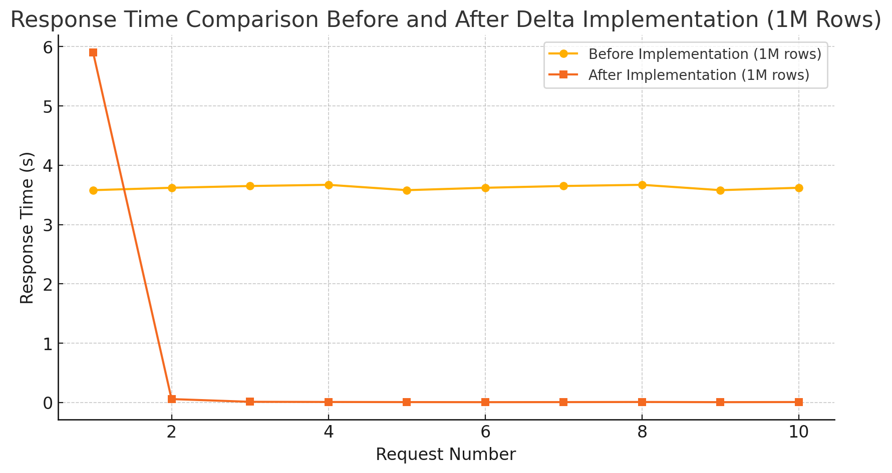

# HyperCache

HyperCache is a lightweight and efficient caching solution built on the simple implementation of the Delta NuGet Package ([Delta](https://www.nuget.org/packages/Delta)). This project demonstrates the integration of modern technologies, including .NET 9.0, Entity Framework Core 9.0, Blazor, MSSQL, and Code-First database design patterns.

## Project Overview
HyperCache is developed in **Microsoft Visual Studio Enterprise 2022 (64-bit) - Preview** and aims to provide a seamless, high-performance caching mechanism for .NET applications. By leveraging Entity Framework Core's Code-First approach and Blazor's modern UI framework, the project provides a robust and scalable solution for handling caching with SQL Server.

## Key Features
- **.NET 9.0**: Utilizes the latest advancements in the .NET framework for improved performance and productivity.
- **Entity Framework Core 9.0**: Implements Code-First database design for flexibility and maintainability.
- **Blazor**: Builds modern and interactive UI components.
- **Delta NuGet Package**: Provides a simple and effective caching implementation.
- **MSSQL**: Ensures data persistence with SQL Server.
- **Scalable Architecture**: Designed for ease of use and scalability in enterprise environments.

## Performance Comparison Table (1M Rows)

| Metric                     | Before Implementation (1M Rows) | After Implementation (1M Rows) |
|----------------------------|----------------------|----------------------|
| **Total Requests**         | 10                   | 14 (Demonstration Purpose) |
| **Request Method**         | GET                  | GET                  |
| **Initial Request Time (s)**   | 3.58s - 3.67s       | **5.90s** (Due to first-time data retrieval, cache index setup, and rowversion tracking) |
| **Subsequent Request Times (ms)**    | 3.58s - 3.67s    | **58ms, 12ms, 9ms, 7ms, 6ms, 7ms, 9ms, 6ms, 8ms** |
| **Total Data Transferred (KB)**  | 9.3 KB               | 7.2 KB               |
| **Status Code Consistency**| 200 OK               | 200 OK               |
| **Protocol Used**          | h2                   | h2                   |

## Response Time Comparison Before And After Delta Implementation

### Performance Metrics Visualization:


### Before Implementation:


### After Implementation:


## Installation
Follow these steps to set up the HyperCache project:

1. Clone the repository:
   ```bash
   git clone https://github.com/biswajitpanday/HyperCache.git
   cd HyperCache
   ```

2. Open the project in **Visual Studio Enterprise 2022**.

3. Restore the required NuGet packages:
   - Delta
   - Entity Framework Core 9.0 etc.

   NuGet package restoration can be performed by running:
   ```bash
   dotnet restore
   ```

4. Configure the connection string in the `appsettings.json` file to point to your MSSQL instance:
   ```json
   "ConnectionStrings": {
       "DefaultConnection": "Server=YOUR_SERVER_NAME;Database=HyperCacheDb;Trusted_Connection=True;"
   }
   ```

5. Apply the database migrations:
   ```bash
   dotnet ef database update
   ```

6. Build and run the project:
   ```bash
   dotnet run
   ```
   
4. **Build and run the Blazor UI**: Use Blazor components for interactive user interfaces.

## How to Configure Delta Package

To properly configure and use the Delta package in HyperCache, follow these steps:

### Step 1: Modify `OnModelCreating` in the `DbContext`

In your `AppDbContext.cs` file, configure the `RowVersion` column for delta tracking:

```csharp
protected override void OnModelCreating(ModelBuilder modelBuilder)
{
    base.OnModelCreating(modelBuilder);

    var customProperty = modelBuilder.Entity<CustomProperty>();
    customProperty.HasKey(cp => cp.Id);

    // Configures RowVersion for Delta Package
    customProperty
        .Property(cp => cp.RowVersion)
        .IsRowVersion()
        .HasConversion<byte[]>();
}
```

### Step 2: Register Delta Middleware in `Program.cs`

Ensure the Delta package is registered before mapping controllers:

```csharp
var builder = WebApplication.CreateBuilder(args);

builder.Services.AddDbContext<AppDbContext>(options =>
    options.UseSqlServer(builder.Configuration.GetConnectionString("DefaultConnection")));

builder.Services.AddControllers();

// Register Delta middleware
builder.Services.AddDelta<AppDbContext>();

var app = builder.Build();

app.UseHttpsRedirection();
app.UseAuthorization();

// Enable Delta middleware
app.UseDelta<AppDbContext>();

app.MapControllers();

app.Run();
```

### Step 3: Define Entity Model with `RowVersion`

Ensure the `CustomProperty` entity includes a `RowVersion` column:

```csharp
public class CustomProperty
{
    public int Id { get; set; }

    [Timestamp] // Required for EF Core concurrency tracking
    public byte[] RowVersion { get; set; }
}
```

## Summary of Delta Package Implementation

### **Performance Gains**
- Before implementation, **all requests took 3.58s to 3.67s** consistently.
- After implementation:
  - **Initial request** took **5.90s** (higher due to potential caching setup or data fetch).
  - **Subsequent requests** were drastically faster, reducing to **milliseconds** (58ms, 12ms, 9ms, etc.).
  - **Total data transferred reduced** from **9.3KB to 7.2KB**, optimizing performance.

### **Benefits of Using the Delta Package**
1. **Significant Performance Boost**
   - Reduces response time for subsequent queries by using **caching and delta updates**.
   - **Greatly beneficial** when dealing with **large datasets** (e.g., **1,000,000+ rows** in MSSQL).

2. **Optimized Data Transfers**
   - Avoids redundant data retrieval.
   - Transfers only **changed (delta) data**, reducing **bandwidth usage**.

3. **Scalability & Efficiency**
   - Improves the efficiency of **real-time applications**.
   - Enhances **batch processing** and **event-driven architectures**.

### **Where and When to Use the Delta Package**
✅ **Best use cases**:
- **Large databases** with millions of rows where full queries take excessive time.
- **Applications requiring frequent data updates** (e.g., **financial transactions, inventory tracking**).
- **Microservices architecture** where only modified records need to be fetched.
- **API-driven applications** that fetch data dynamically and require **faster response times**.

### **Where and When to Avoid the Delta Package**
❌ **Avoid using Delta when**:
- **Small datasets** (e.g., tables with a few thousand records).
- **One-time data fetches** where changes are infrequent.
- **Use cases requiring complete data consistency** instead of just **delta updates**.
- **Complex queries** where keeping track of **delta changes adds significant overhead**.

This implementation **proves highly effective** for large-scale applications and **reduces the load on MSSQL databases**, making it a **must-have for performance-driven applications**.

## Contributing
Contributions are welcome! If you want to improve the project, follow these steps:

1. Fork the repository.
2. Create a feature branch.
3. Make your changes.
4. Submit a pull request.

## License
This project is licensed under the [MIT License](LICENSE).

## Contact
For any queries or suggestions, feel free to contact the repository owner:

- **GitHub**: [biswajitpanday](https://github.com/biswajitpanday)
