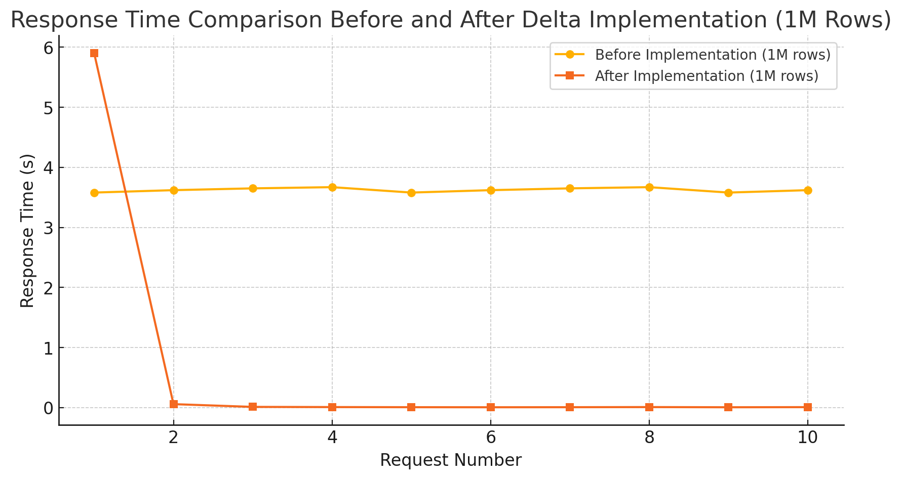
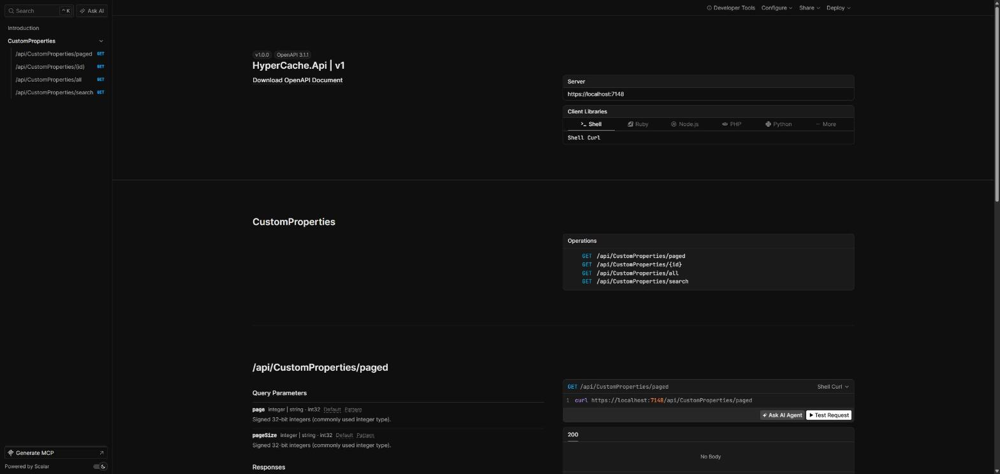

# HyperCache

[](https://github.com/biswajitpanday/HyperCache/actions/workflows/ci.yml)


[](LICENSE.txt)

HyperCache is a lightweight and efficient caching solution built on the simple implementation of the Delta NuGet Package ([Delta.EF](https://www.nuget.org/packages/Delta.EF)). This project demonstrates the integration of modern technologies, including .NET 10, C# 14, Entity Framework Core 10, Blazor WebAssembly, MSSQL, and Code-First database design patterns.

## Project Overview
HyperCache is developed with the **.NET 10 SDK** and **Visual Studio 2026** and aims to provide a seamless, high-performance caching mechanism for .NET applications. By leveraging Entity Framework Core's Code-First approach and Blazor's modern UI framework, the project provides a robust and scalable solution for handling caching with SQL Server.

The solution has three projects:

| Project | Purpose |
|---|---|
| `HyperCache/` (`HyperCache.Api`) | ASP.NET Core Web API + EF Core 10 + Delta middleware. Seeds 1,000,000 rows on first start. |
| `HyperCache.Web/` | Standalone Blazor WebAssembly client that calls the API. |
| `HyperCache.Api.Tests/` | xUnit smoke tests that boot the API in-process against a throw-away SQL Server database. |

## Key Features
- **.NET 10 (LTS) / C# 14**: Utilizes the latest advancements in the .NET framework and language.
- **Entity Framework Core 10**: Implements Code-First database design for flexibility and maintainability.
- **Blazor WebAssembly**: Builds modern and interactive UI components, with .NET 10 fingerprinted static assets.
- **Delta.EF**: Provides a simple and effective HTTP caching implementation (ETag / `304 Not Modified`).
- **OpenAPI + Scalar**: Self-describing API with a browsable reference UI at `/scalar` in Development.
- **MSSQL**: Ensures data persistence with SQL Server.
- **Scalable Architecture**: Designed for ease of use and scalability in enterprise environments.

## Performance Comparison Table (1M Rows)

> Measured on the original .NET 9 build of this project. After the .NET 10 upgrade the behaviour was re-verified on a developer laptop: `GET /api/customproperties/all` over 1,000,000 rows took ~7 s uncached and ~16 ms with a matching `If-None-Match` (`304 Not Modified`).

| Metric                     | Before Implementation (1M Rows) | After Implementation (1M Rows) |
|----------------------------|----------------------|----------------------|
| **Total Requests**         | 10                   | 14 (Demonstration Purpose) |
| **Request Method**         | GET                  | GET                  |
| **Initial Request Time (s)**   | 3.58s - 3.67s       | **5.90s** (Due to first-time data retrieval, cache index setup, and rowversion tracking) |
| **Subsequent Request Times (ms)**    | 3.58s - 3.67s    | **58ms, 12ms, 9ms, 7ms, 6ms, 7ms, 9ms, 6ms, 8ms** |
| **Total Data Transferred (KB)**  | 9.3 KB               | 7.2 KB               |
| **Status Code Consistency**| 200 OK               | 200 OK               |
| **Protocol Used**          | h2                   | h2                   |

## Response Time Comparison Before And After Delta Implementation

### Performance Metrics Visualization:


### Before Implementation:


### After Implementation:


## Prerequisites
- [.NET 10 SDK](https://dotnet.microsoft.com/download/dotnet/10.0) (the repo's `global.json` pins the 10.0.4xx band)
- SQL Server (any edition; tested with SQL Server 2025 Developer)
- Optional: Visual Studio 2026 (18.0+) or any editor
- Optional: `dotnet tool install --global dotnet-ef` for migrations

## Installation
Follow these steps to set up the HyperCache project:

1. Clone the repository:
   ```bash
   git clone https://github.com/biswajitpanday/HyperCache.git
   cd HyperCache
   ```

2. Restore the NuGet packages:
   ```bash
   dotnet restore
   ```

3. Point the API at your SQL Server. Create `HyperCache/appsettings.Development.json` (git-ignored) or edit `HyperCache/appsettings.json`:
   ```json
   {
     "ConnectionStrings": {
       "DefaultConnection": "Server=localhost;Database=HyperCacheDB;Trusted_Connection=True;TrustServerCertificate=True;MultipleActiveResultSets=true"
     }
   }
   ```
   For SQL authentication replace `Trusted_Connection=True` with `User ID=...;Password=...`.

4. Apply the database migrations (run from the API project folder):
   ```bash
   cd HyperCache
   dotnet ef database update
   cd ..
   ```

5. Run the API. Use the `https` profile — the Blazor client is hard-wired to `https://localhost:7148`:
   ```bash
   dotnet run --project HyperCache/HyperCache.Api.csproj --launch-profile https
   ```
   On first start against an empty database the API seeds **1,000,000** rows before it begins listening; expect a few minutes. See [Configuration](#configuration) to lower that for local work.

6. Run the Blazor client in a second terminal and open `https://localhost:7222`:
   ```bash
   dotnet run --project HyperCache.Web/HyperCache.Web.csproj --launch-profile https
   ```

## Configuration

| Setting | Where | Default | Notes |
|---|---|---|---|
| `ConnectionStrings:DefaultConnection` | `appsettings*.json` / env `ConnectionStrings__DefaultConnection` | placeholder | SQL Server connection string. |
| `Seed:Count` | `appsettings*.json` / env `Seed__Count` | `1000000` | Rows inserted when the `CustomProperties` table is empty. Seeding is skipped if the table already has rows; use `dotnet ef database drop` to start over. |

Example of a fast local start:
```bash
Seed__Count=20000 dotnet run --project HyperCache/HyperCache.Api.csproj --launch-profile https
```

## API

| Endpoint | Description |
|---|---|
| `GET /api/customproperties/paged?page=1&pageSize=20` | Paged list with `CurrentPage`, `TotalPages`, `HasPreviousPage`, `HasNextPage`. |
| `GET /api/customproperties/all` | Every row (the request used in the benchmarks above). |
| `GET /api/customproperties/search?keyword=Orders` | Name contains `keyword`. |
| `GET /api/customproperties/{id}` | Single row by GUID; `400` for a malformed id, `404` if unknown. |
| `GET /openapi/v1.json` | OpenAPI 3.1 document (Development only). |
| `GET /scalar` | Browsable API reference UI (Development only). |

`HyperCache/HyperCache.http` contains ready-made requests for all of these, including the `If-None-Match` round-trip that shows Delta returning `304`.

### API Reference (Scalar)


## How Delta Is Wired Up

Delta is a middleware, not a service. Three pieces make it work in this project:

### 1. A `rowversion` column on the entity (`Models/CustomProperty.cs`)

```csharp
public class CustomProperty
{
    public Guid Id { get; set; }
    // ...
    [Timestamp] // SQL Server rowversion; every write bumps @@DBTS
    public byte[] RowVersion { get; set; } = [];
}
```

### 2. The column mapped as a row version (`Data/AppDbContext.cs`)

```csharp
protected override void OnModelCreating(ModelBuilder modelBuilder)
{
    base.OnModelCreating(modelBuilder);

    var customProperty = modelBuilder.Entity<CustomProperty>();
    customProperty.HasKey(cp => cp.Id);

    customProperty
        .Property(cp => cp.RowVersion)
        .IsRowVersion();
}
```

The `AddDeltaRowVersion` migration adds this column to the existing table.

### 3. The middleware, registered after CORS (`Program.cs`)

```csharp
builder.Services.AddDbContext<AppDbContext>(options =>
    options.UseSqlServer(builder.Configuration.GetConnectionString("DefaultConnection")));

var app = builder.Build();

// CORS first: Delta short-circuits with 304 and that response still needs the CORS headers
// for the cross-origin Blazor client.
app.UseCors(x => x.AllowAnyOrigin());

// Every GET gets an ETag; a matching If-None-Match is answered with 304 before any controller runs.
app.UseDelta<AppDbContext>();

// Or scope it to specific paths:
// app.UseDelta<AppDbContext>(shouldExecute: ctx => ctx.Request.Path.ToString().Contains("CustomProperties"));

app.MapControllers();
app.Run();
```

### How Delta detects changes

Delta derives the ETag from a database-wide "last change" stamp, so it never has to look at the rows a request would return. On SQL Server it uses, in order of preference:

1. `sys.dm_db_log_stats` (requires `VIEW SERVER STATE`),
2. `change_tracking_current_version()` if change tracking is enabled on the database,
3. `@@DBTS`, the database's current `rowversion` value.

This project relies on option 3, which is why the `rowversion` column matters: any insert/update to `CustomProperties` advances `@@DBTS`, invalidating every cached ETag. Enabling SQL Server change tracking (`ALTER TABLE ... ENABLE CHANGE_TRACKING`) is optional and not required for the demo.

## Running the Tests

The tests boot the real API in-process (`WebApplicationFactory`) and need a reachable SQL Server because Delta reads `@@DBTS`. On each run they drop and re-create a database named `HyperCacheDB_Test` and seed it with 200 rows.

```bash
dotnet test HyperCache.slnx
```

The same suite runs in GitHub Actions on every push and pull request (`.github/workflows/ci.yml`), against a SQL Server 2022 container started in the job with a password generated per run.

The connection is taken from `HYPERCACHE_TEST_CONNECTION` if set, otherwise from the API's `ConnectionStrings:DefaultConnection` with the database name swapped to `HyperCacheDB_Test`.

Covered: paged response shape and `ETag`, `If-None-Match` → `304`, search (including the empty-keyword `400`), details (`400` / `404` / `200`), and the OpenAPI document.

## C# 14 Features Used

| Feature | Where |
|---|---|
| Extension members (`extension<T>(IQueryable<T> source) { ... }`) | `HyperCache/Extensions/QueryableExtensions.cs` — `ToPagedAsync` used by the controller |
| `field` keyword | `HyperCache/Data/SeedOptions.cs` — setter validation with no hand-written backing field |
| Collection expressions, primary constructors, `required` members | throughout |

Features such as null-conditional assignment, `nameof` on unbound generics, and partial constructors have no natural home in a codebase this small and are deliberately not shoe-horned in.

## Summary of Delta Package Implementation

### **Performance Gains**
- Before implementation, **all requests took 3.58s to 3.67s** consistently.
- After implementation:
  - **Initial request** took **5.90s** (higher due to potential caching setup or data fetch).
  - **Subsequent requests** were drastically faster, reducing to **milliseconds** (58ms, 12ms, 9ms, etc.).
  - **Total data transferred reduced** from **9.3KB to 7.2KB**, optimizing performance.

### **Benefits of Using the Delta Package**
1. **Significant Performance Boost**
   - Reduces response time for subsequent queries by using **caching and delta updates**.
   - **Greatly beneficial** when dealing with **large datasets** (e.g., **1,000,000+ rows** in MSSQL).

2. **Optimized Data Transfers**
   - Avoids redundant data retrieval.
   - Transfers only **changed (delta) data**, reducing **bandwidth usage**.

3. **Scalability & Efficiency**
   - Improves the efficiency of **real-time applications**.
   - Enhances **batch processing** and **event-driven architectures**.

### **Where and When to Use the Delta Package**
✅ **Best use cases**:
- **Large databases** with millions of rows where full queries take excessive time.
- **Applications requiring frequent data updates** (e.g., **financial transactions, inventory tracking**).
- **Microservices architecture** where only modified records need to be fetched.
- **API-driven applications** that fetch data dynamically and require **faster response times**.

### **Where and When to Avoid the Delta Package**
❌ **Avoid using Delta when**:
- **Small datasets** (e.g., tables with a few thousand records).
- **One-time data fetches** where changes are infrequent.
- **Use cases requiring complete data consistency** instead of just **delta updates**.
- **Complex queries** where keeping track of **delta changes adds significant overhead**.

This implementation **proves highly effective** for large-scale applications and **reduces the load on MSSQL databases**, making it a **must-have for performance-driven applications**.

## Contributing
Contributions are welcome! If you want to improve the project, follow these steps:

1. Fork the repository.
2. Create a feature branch.
3. Make your changes.
4. Submit a pull request.

## License
This project is licensed under the [MIT License](LICENSE.txt).

## Contact
For any queries or suggestions, feel free to contact the repository owner:

- **GitHub**: [biswajitpanday](https://github.com/biswajitpanday)
